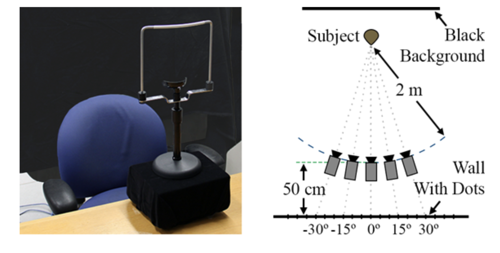

# Enhancing AI-Human Interaction: Introducing the Eye Contact Recognition ModelEnhancing AI-Human Interaction: Introducing the Eye Contact Recognition Model

## Background:

Nowadays, we use voice commands like “Hey Siri” to talk to machines. But these chats can feel a bit odd because they're missing the natural way people talk to each other. When we talk to people, we don't just use words; we also use our eyes and body language.

## The Problem:

Most smart machines today can't understand when someone is looking at them. Eye contact is a big part of how we communicate without speaking. We look at each other to show we're interested or ready to talk. By not noticing when someone looks at them, machines miss a big chance to chat in a more friendly way.

## Objective and Solution:

This project introduces an innovative approach to AI-human interactions. I've developed a human attention detector leveraging a binary image classifier built on the VGG16 architecture. This model is adept at detecting whether an individual is making eye contact with the device.

- **Architecture:** Utilizing VGG16, a robust architecture in computer vision, for transfer learning.
- **Extensive Training:** The model underwent 500 epochs of training on diverse datasets featuring various head poses and gaze directions.
- **Enhanced Accuracy:** Implementation of regression techniques (eventually used mediapipe for best accuracy) for precise localization of the eye area, achieving 83% validation accuracy.

## Datasets

### Detailed Statistics

- **Number of Images**: 5,880
- **Number of Subjects**: 56 (32 male, 24 female)
- **Ethnic Diversity**: 21 Asian, 19 White, 8 South Asian, 7 Black, 4 Hispanic or Latino
- **Age Range**: 18 - 36 years
- **Subjects with Glasses**: 21
- **Image Resolution**: 5,184 x 3,456 pixels

Each subject is captured in various combinations of five horizontal head poses (0°, ±15°, ±30°) and seven horizontal (0°, ±5°, ±10°, ±15°) plus three vertical gaze directions (0°, ±10°). The dataset includes a specific focus on 'gaze locking' images for each subject across different head poses.

### Collection Procedure

The images were taken using a Canon EOS Rebel T3i camera and Canon EF-S 18–135 mm IS zoom lens. Subjects were positioned against a black background, facing a grid of dots for consistent gaze and head pose alignment. A chin rest helped stabilize the head, ensuring accurate gaze direction capture. The meticulous collection process included capturing multiple images per gaze direction and selecting the best one for clarity and accuracy.

## Results

## Real-Time Detection

- By leveraging OpenCV, our system can operate in real-time to determine whether a person is focused on the camera. When attention is detected, a green block appears on the screen.
  **check the real_time_detection.ipynb file for this functionality**

## Reference

For more information on the foundational concepts used in this project, refer to the following academic paper:

**Gaze Locking: Passive Eye Contact Detection for Human-Object Interaction**  
Authors: B.A. Smith, Q. Yin, S.K. Feiner, and S.K. Nayar  
Published in: ACM Symposium on User Interface Software and Technology (UIST), October 2013  
Pages: 271-280  
Resources: [PDF](http://www.cs.columbia.edu/~brian/publications/gaze_locking.html) | [BibTeX](http://www1.cs.columbia.edu/CAVE/publications/pub_bibtex.php?id=324) | [Copyright Info](http://www1.cs.columbia.edu/CAVE/publications/copyright.html) | [Project Page](http://www.cs.columbia.edu/CAVE/projects/gaze_locking/)
